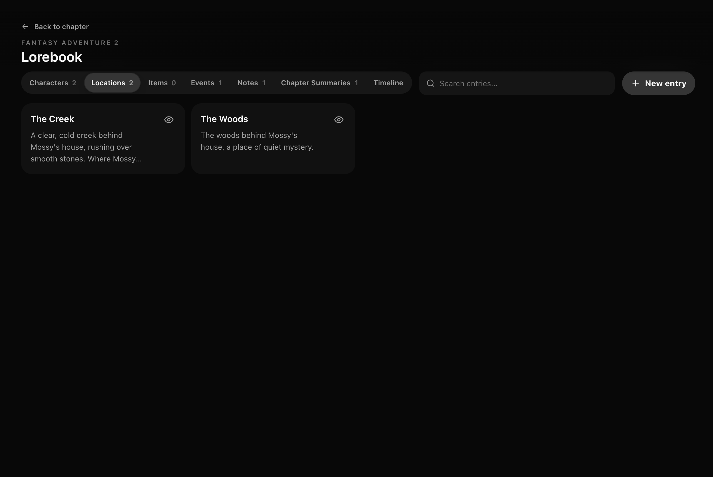

<div align="center">

# RouterChat 1.1.6

**A free, local OpenRouter interface for chatting and longform writing.**

Strictly BYOK. Available for macOS and Windows.

<p>
  <a href="#install-routerchat">Install</a> ·
  <a href="#features">Features</a> ·
  <a href="#media">Screenshots</a> ·
  <a href="setup.md">Setup guide</a> ·
  <a href="https://github.com/echo1097/routerchat/releases">Releases</a> ·
  <a href="SUPPORT.md">Support</a>
</p>


</div>

## Disclaimer

RouterChat is provided as-is. You are responsible for how you use it, including your use of third-party models, API keys, generated content, and any costs or consequences from that use. By using RouterChat you agree to abide by [the terms of service](TOS.md).

As of August 3, 2026, RouterChat is distributed under the [Apache License 2.0](LICENSE). Releases up to and including 0.3.5 remain available under the MIT License.

**As of September 13, 2026, RouterChat is in maintenance mode. Future updates are limited to critical bug fixes, security fixes, dependency compatibility, and release infrastructure issues.**

## Install RouterChat

RouterChat runs locally and only needs an [OpenRouter API key](https://openrouter.ai/keys). 

You can inspect the open-source [macOS installer](https://github.com/echo1097/get-routerchat/blob/main/install.sh) or [Windows installer](https://github.com/echo1097/get-routerchat/blob/main/install.ps1) before running it.

**macOS (Apple Silicon or Intel):**

```sh
curl -fsSL https://echo1097.github.io/get-routerchat/install.sh | sh
```

**Windows x64:**

```powershell
powershell -NoProfile -ExecutionPolicy Bypass -Command "irm https://echo1097.github.io/get-routerchat/install.ps1 | iex"
```

See the [setup guide](setup.md) for starting, updating, repairing, data locations, and manual developer installation. 

For support with any issues that arise, see [SUPPORT.md](SUPPORT.md) and if necessary fill out [this form](https://forms.gle/gTth2TcXLYAArvGm6).

To remove RouterChat, run **Uninstall RouterChat** from `~/Applications/RouterChat` on macOS or the Start Menu on Windows. The uninstaller can save your database to Downloads before removing the app.

> [!WARNING]
> Tested locally on macOS Apple Silicon and on Windows 11 x64 using a sandbox VM. macOS Intel has not yet been tested.

## Features

- **Chat Mode:** A local chat interface with model selection, web search, file attachments, temporary chats, and chat history.
- **Writing Mode:** A dedicated longform writing workspace. Create stories, organize them into chapters, brainstorm ideas, and make a lorebook for characters and world details.

## Roadmap

RouterChat 1.1.6 is stable and the project is now in maintenance mode. New feature development is paused. Future updates are limited to critical bug fixes, security fixes, dependency compatibility, and release infrastructure issues.

## Features added

- One-click installer
    - macOS and Windows
- UI improvements
    - Navigation bar for moving through long chats
    - Model context meter and warnings when context is getting full
    - Guided tours for Chat and Write modes
- Writing Mode improvements
    - Brainstorming canvas with branching ideas, copy buttons, and prompt regeneration
    - Create and edit chapters with a formatting toolbar
    - Chapter history
    - Import and export full stories, including chapters and lorebooks
- Chat Mode improvements
    - Web search with sources and citations
    - Image, PDF, text, and code attachments, including drag and drop
    - Folders, pinned chats, and chat search
    - Temporary chats
    - Automatically generated chat names
    - Chat import and export
    - Edit prompts, regenerate replies, and view response token usage and costs
- Memory for Write mode
    - Lorebook entries for characters, locations, items, events, notes, chapter summaries, and timeline
    - Manual and model-generated entries, with automatic or manual lorebook updates
    - Lorebook and timeline repair tools
- Voice input
    - Record and transcribe speech in Chat, Write, and Brainstorm
- Usage tracking
    - Spending, request counts, and token usage for the last 7 days
    - Lifetime totals per model
- Model settings
    - Model search and default model selection
    - System prompts, temperature, output limits, and supported reasoning controls
    - Fastest or lowest-priced provider preferences
    - Privacy and Zero Data Retention routing options

## AI usage disclaimer

AI was used to support development and documentation for this project. All code and documentation were reviewed by myself before being published.

## Bug reporting, feedback, and contributing
- To report a bug open an issue and provide as much context and information as you can so I can reproduce and fix it. Alternatively if you do not have a GitHub account and prefer not to create one, fill out [this form](https://forms.gle/gTth2TcXLYAArvGm6) instead.
- To provide feedback fill out [this form](https://forms.gle/gTth2TcXLYAArvGm6).
- AI slop pull requests will not be merged. If you are using AI to assist your development, clean up and review the code manually and be transparent in your usage of AI.

## Local data

Packaged installations keep the OpenRouter key and database outside the replaceable application directory. Git clone installations continue to use `.env` and `data/routerchat.sqlite3` inside the repository. Saved chats and settings stay on your computer, and the project author never receives them or your API key. When you send a prompt, attachment, or voice recording, the relevant data is sent to OpenRouter so it can provide the requested service. See [TOS.md](TOS.md) for the complete list of connections.

## Media

Chat Mode


Lorebook



Lorebook entry


Write Mode


