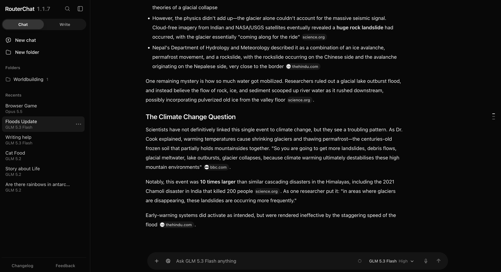

<div align="center">


# RouterChat

**A free, local OpenRouter interface for chatting and longform writing.**

Bring your own key. Available for macOS and Windows.

<p>
  <a href="#install-routerchat">Install</a> ·
  <a href="#features">Features</a> ·
  <a href="#media">Screenshots</a> ·
  <a href="setup.md">Setup guide</a> ·
  <a href="https://github.com/echo1097/routerchat/releases">Releases</a> ·
  <a href="SUPPORT.md">Support</a>
</p>


</div>

## Disclaimer

RouterChat is provided as-is. You are responsible for how you use it, including third-party models, API keys, generated content, and any resulting costs or consequences. By using RouterChat you agree to the [terms of service](TOS.md).

RouterChat is licensed under the [Apache License 2.0](LICENSE) as of August 3, 2026. Releases up to and including 0.3.5 remain available under the MIT License.

## Install RouterChat

All you need is an [OpenRouter API key](https://openrouter.ai/keys). Both installers are open source, so you can read the [macOS installer](https://github.com/echo1097/get-routerchat/blob/main/install.sh) or [Windows installer](https://github.com/echo1097/get-routerchat/blob/main/install.ps1) before running it.

**macOS (Apple Silicon or Intel):**

```sh
curl -fsSL https://echo1097.github.io/get-routerchat/install.sh | sh
```

**Windows x64:**

```powershell
powershell -NoProfile -ExecutionPolicy Bypass -Command "irm https://echo1097.github.io/get-routerchat/install.ps1 | iex"
```

- **Setup:** The [setup guide](setup.md) covers starting, updating, repairing, data locations, and manual developer installation.
- **Help:** See [SUPPORT.md](SUPPORT.md), or fill out [this form](https://forms.gle/gTth2TcXLYAArvGm6) if you still need help.
- **Uninstall:** On macOS, double-click `Uninstall RouterChat.command` in the **RouterChat** folder on your Desktop. On Windows, open **Uninstall RouterChat** from the Start Menu. It can save your database to Downloads before removing the app.

> [!WARNING]
> Tested on macOS Apple Silicon and on Windows 11 x64 in a sandbox VM. macOS Intel has not been tested yet.

## Features

- **Chat Mode:** Chat with any OpenRouter model, with web search, file attachments, temporary chats, and chat history.
- **Writing Mode:** A longform writing workspace. Write stories in chapters, brainstorm ideas, and keep a lorebook of characters and world details.

## Roadmap

The top priority right now is support for more API providers.

## Features added

- One-click installer
    - macOS and Windows
- UI improvements
    - Navigation bar for moving through long chats
    - Context meter that shows how full a model's context is
    - Guided tours for Chat and Write modes
    - In-app changelog
    - Feedback button
- Writing Mode improvements
    - Brainstorming canvas with branching ideas, copy buttons, and prompt regeneration
    - Chapter editor with a formatting toolbar
    - Chapter history
    - Remove chapters from the context
    - Import and export full stories, including chapters and lorebooks
- Chat Mode improvements
    - Web search with sources and citations
    - Image, PDF, text, and code attachments, with drag and drop
    - Folders, pinned chats, and chat search
    - Temporary chats
    - Automatic chat names
    - Chat import and export
    - Edit prompts, regenerate replies, and see token usage and cost for each response
    - Copy buttons on prompts
- Memory for Write mode
    - Lorebook entries for characters, locations, items, events, notes, chapter summaries, and a timeline
    - Write entries yourself or let the model generate them, with automatic or manual lorebook updates
    - Repair tools for the lorebook and timeline
- Voice input
    - Record and transcribe speech in Chat, Write, and Brainstorm
    - Choose which transcription model to use
- Usage tracking
    - Spending, request counts, and token usage for the last 7 days
    - Token breakdown split into input, cached reads, output, and reasoning
    - Lifetime totals per model
- Prompt caching
    - On by default in Chat and Write modes to save on repeat tokens
    - Can be turned off in API settings
- Model settings
    - Model search and a default model
    - Option to hide batch models
    - System prompts, temperature, output limits, and reasoning controls where supported
    - Reasoning level shown on the model button
    - Provider preference for fastest or lowest price
    - Privacy and Zero Data Retention routing options

## AI usage disclaimer

AI helped with development and documentation for this project. I reviewed all code and documentation before publishing it.

## Bug reporting, feedback, and contributing

- **Bugs:** Open an issue with as much detail as you can so I can reproduce and fix it. If you don't have a GitHub account, use [this form](https://forms.gle/gTth2TcXLYAArvGm6) instead.
- **Feedback:** Fill out [this form](https://forms.gle/gTth2TcXLYAArvGm6).
- **Pull requests:** AI slop pull requests will not be merged. If you use AI, review and clean up the code yourself and say how you used it.

## Local data

Your chats, settings, and API key stay on your computer, and the project author never receives them. Packaged installs keep the OpenRouter key and database outside the app folder, so updates don't replace them. Git clone installs keep using `.env` and `data/routerchat.sqlite3` inside the repository.

When you send a prompt, attachment, or voice recording, that data goes to OpenRouter so it can handle the request. See [TOS.md](TOS.md) for the full list of connections.

## Media

Chat Mode



Lorebook


Lorebook entry


Write Mode


