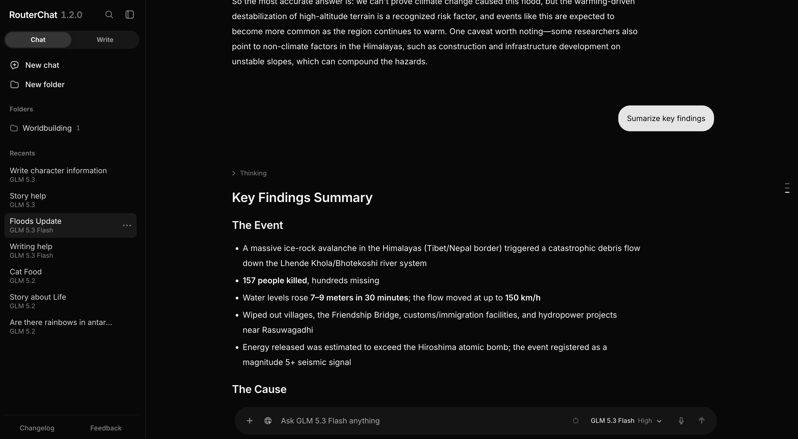
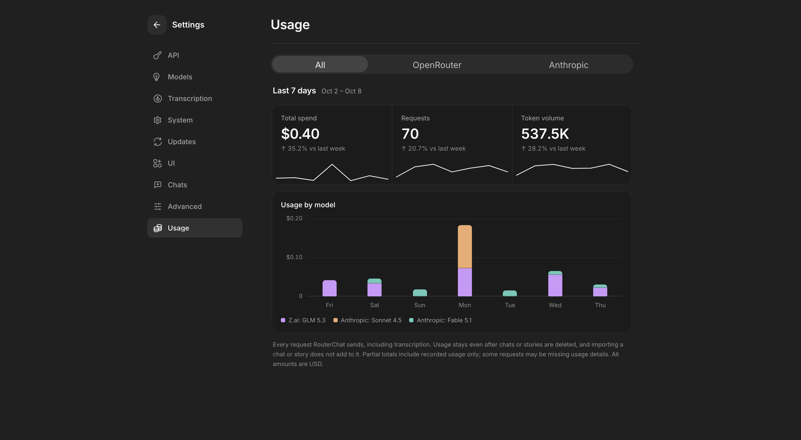

<div align="center">


# RouterChat

**A free, local OpenRouter interface for chatting and longform writing.**

Bring your own key. Available for macOS and Windows.

<p>
  <a href="#install-routerchat">Install</a> ·
  <a href="#features">Features</a> ·
  <a href="#media">Screenshots</a> ·
  <a href="setup.md">Setup guide</a> ·
  <a href="https://github.com/echo1097/routerchat/releases">Releases</a> ·
  <a href="SUPPORT.md">Support</a>
</p>


</div>

## Disclaimer

RouterChat is provided as-is. You are responsible for how you use it, including third-party models, API keys, generated content, and any resulting costs or consequences. By using RouterChat you agree to the [terms of service](TOS.md).

RouterChat is licensed under the [Apache License 2.0](LICENSE) as of August 3, 2026. Releases up to and including 0.3.5 remain available under the MIT License.

## Install RouterChat

All you need is an [OpenRouter API key](https://openrouter.ai/keys). 

**macOS (Apple Silicon or Intel)** ([inspect installer](https://github.com/echo1097/get-routerchat/blob/main/install.sh))

```sh
curl -fsSL https://echo1097.github.io/get-routerchat/install.sh | sh
```

**Windows x64**, paste into PowerShell ([inspect installer](https://github.com/echo1097/get-routerchat/blob/main/install.ps1))

```powershell
irm https://echo1097.github.io/get-routerchat/install.ps1 | iex
```

- **Setup:** The [setup guide](setup.md) covers starting, updating, repairing, and data locations. The [developer guide](developer.md) covers building from source.
- **Help:** See [SUPPORT.md](SUPPORT.md), or fill out [this form](https://forms.gle/gTth2TcXLYAArvGm6) if you still need help.
- **Uninstall:** On macOS, double-click `Uninstall RouterChat.command` in the **RouterChat** folder on your Desktop. On Windows, open **Uninstall RouterChat** from the Start Menu. It can save your database to Downloads before removing the app.

> [!WARNING]
> Tested on macOS Apple Silicon and on Windows 11 x64 in a sandbox VM. macOS Intel has not been tested yet.

## Features

- **Chat Mode:** Chat with any OpenRouter model, with web search, file attachments, temporary chats, and chat history.
- **Writing Mode:** A longform writing workspace. Write stories in chapters, brainstorm ideas, and keep a lorebook of characters and world details.

## Roadmap

The top priority right now is support for more API providers.

## Features added

See [features.md](features.md) for the full list of what has been added so far.

## AI usage disclaimer

AI helped with development and documentation for this project. I reviewed all code and documentation before publishing it.

## Bug reporting, feedback, and contributing

- **Bugs:** Open an issue with as much detail as you can so I can reproduce and fix it. If you don't have a GitHub account, use [this form](https://forms.gle/gTth2TcXLYAArvGm6) instead.
- **Feedback:** Fill out [this form](https://forms.gle/gTth2TcXLYAArvGm6).
- **Pull requests:** AI slop pull requests will not be merged. If you use AI, review and clean up the code yourself and say how you used it.

## Local data

Your chats, settings, and API key stay on your computer, and the project author never receives them. Packaged installs keep the OpenRouter key and database outside the app folder, so updates don't replace them. Git clone installs keep using `.env` and `data/routerchat.sqlite3` inside the repository.

When you send a prompt, attachment, or voice recording, that data goes to OpenRouter so it can handle the request. See [TOS.md](TOS.md) for the full list of connections.

## Media

Chat Mode



Usage



Lorebook entry


Write Mode


